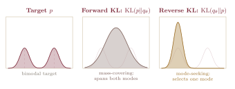
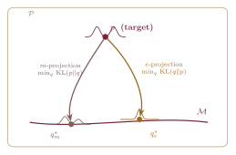

## The Trap of Symmetry

The [first ruler](../the-first-ruler-of-distinguishability/) and the [second ruler](../the-second-ruler-of-displacement/) gave us two beautiful geometries. Both are symmetric. The Fisher metric satisfies $F_{ij}(\theta)=F_{ji}(\theta)$ by construction. The Wasserstein distance satisfies $W_2(\mu,\nu)=W_2(\nu,\mu)$ because the ground cost is symmetric. Fisher measures local statistical distinguishability; Wasserstein measures the global cost of transporting mass. Neither, by itself, records a preferred direction.

Symmetry is natural for distance. But learning is directional.

Consider entropy. A probability distribution concentrated on a single event has very low entropy; it carries a precise prediction. On a fixed finite support, a uniform distribution has maximum entropy; absent further structure, it expresses maximal uncertainty about which event will occur. The transition from concentrated to diffuse can happen by losing or forgetting information. The reverse transition, from diffuse to concentrated, requires evidence or additional structure. The two directions are not equivalent.

This directionality is not a complication to be engineered away. It is part of the structure of inference. Updating beliefs from prior to posterior is not the same operation as moving from posterior back to prior. Fitting a model to data is not the same as generating data from a model. The geometry that captures this structure must remember orientation.

The object that does this is the Kullback--Leibler divergence. It is not a failed metric that merely happens to lack symmetry. It is a *contrast function*: a directed comparison that remembers which distribution supplies the expectation and which serves as the reference. Understanding this asymmetry is the key to seeing why Fisher and Wasserstein geometry are complementary rather than redundant, and why a richer object---the Schrödinger bridge---is needed to connect them.

## KL Divergence: A Directed Contrast

Let $p$ and $q$ be probability distributions over the same measurable space $X$, with $p$ absolutely continuous with respect to $q$. The *Kullback--Leibler divergence* of $p$ relative to $q$ is [@kullback1951]

$$
\mathrm{KL}(p\|q)
=
\int_X p(x)\log\frac{p(x)}{q(x)}\,dx
=
\mathbb E_p\!\left[\log p(X)-\log q(X)\right].
$$ {#eq-kl-definition}

The expectation is taken under $p$: the *first argument* determines which regions of $X$ receive weight. This is the source of the asymmetry and the mechanism behind almost everything that follows.

::: {.callout-tip .math-depth title="Mathematical Depth"}
***Basic properties.***

***Non-negativity.*** For probability measures $p$ and $q$,

$$
\mathrm{KL}(p\|q)\geq 0,
$$ {#eq-kl-nonnegative}

with equality if and only if $p=q$ almost everywhere. When $p$ and $q$ are densities with common support, Jensen's inequality applied to the concave function $\log$ gives

$$
-\mathrm{KL}(p\|q)
=
\mathbb E_p\!\left[\log\frac{q}{p}\right]
\leq
\log\mathbb E_p\!\left[\frac{q}{p}\right]
=
\log 1
=0.
$$ {#eq-kl-jensen}

***Not a metric.*** In general,

$$
\mathrm{KL}(p\|q)
\neq
\mathrm{KL}(q\|p),
$$ {#eq-kl-asymmetry}

and KL does not satisfy the triangle inequality.

***Support constraint.*** For $\mathrm{KL}(p\|q)$ to be finite, $p$ must be absolutely continuous with respect to $q$, written $p\ll q$. If $q=0$ while $p>0$ on a set of positive $p$-measure, then $\mathrm{KL}(p\|q)=+\infty$.

***Invariance.*** At the measure level, KL is invariant under invertible measurable transformations of $X$. For smooth changes of coordinates, the Jacobian factors in the two transformed densities cancel inside the log-ratio.
:::

One useful way to read $\mathrm{KL}(p\|q)$ is as the surprise incurred by using $q$ as a model when observations are distributed according to $p$. If events are encoded optimally for $q$ but generated from $p$, the expected excess code length is $\mathrm{KL}(p\|q)$ nats when the natural logarithm is used, or bits when the logarithm is base two. The asymmetry is natural: the cost of using the wrong model depends on what actually occurs, and that is governed by $p$.

## Two Directions, Two Behaviors

The asymmetry of KL is not merely formal. It can produce qualitatively different approximations depending on which distribution appears in the first argument.

***Forward KL.*** Consider

$$
\mathrm{KL}\!\left(p_{\mathrm{data}}\|p_\theta\right).
$$ {#eq-forward-kl}

The expectation is taken under $p_{\mathrm{data}}$, so every region carrying data probability contributes to the objective. A finite divergence requires $p_\theta$ to assign probability wherever $p_{\mathrm{data}}$ does. Under a restricted model family, this pressure commonly produces *zero-avoiding* or *mass-covering* behavior.

Minimizing forward KL over a parametric family gives maximum likelihood estimation at the population level [@fisher1925]:

$$
\operatorname*{arg\,min}_{\theta}
\mathrm{KL}\!\left(p_{\mathrm{data}}\|p_\theta\right)
=
\operatorname*{arg\,max}_{\theta}
\mathbb E_{p_{\mathrm{data}}}
\left[\log p_\theta(X)\right].
$$ {#eq-forward-kl-mle}

In practice, the expectation is replaced by an empirical average over observed samples. Maximum likelihood is therefore a forward-KL projection at the population level.

***Reverse KL.*** Now consider

$$
\mathrm{KL}\!\left(p_\theta\|p_{\mathrm{data}}\right).
$$ {#eq-reverse-kl}

The expectation is under the model. The objective penalizes the model strongly for assigning mass where the target density is very small, but it does not directly average over target regions the model never visits. In common restricted-family examples, this creates *zero-forcing* or *mode-seeking* behavior: the approximation may concentrate on one target mode rather than bridge low-density regions between several modes.

Reverse KL is the standard divergence appearing in the evidence lower bound used in much of variational inference [@wainwright2008]. It is not the only possible variational objective, but it is computationally attractive because expectations under the tractable approximation can often be estimated directly.

{#fig-forward-reverse-kl width="100%" fig-alt="Three-panel diagram showing a bimodal target, a broad forward-KL Gaussian covering both modes, and a narrow reverse-KL Gaussian concentrated on one mode."}

::: {.callout-note .learning-box title="Consequence for Learning"}
The contrast between forward and reverse KL directly shapes the behavior of widely used learning procedures.

***Maximum likelihood*** minimizes $\mathrm{KL}(p_{\mathrm{data}}\|p_\theta)$ at the population level. Under capacity or likelihood restrictions, it is pressured to cover all observed modes. In conditional models with simple likelihoods, such as a Gaussian with fixed variance, that pressure can manifest as averaged or blurry predictions.

***Variational inference*** commonly minimizes $\mathrm{KL}(q\|p_{\mathrm{posterior}})$. If the variational family cannot represent a complex multimodal posterior, the approximation may select one mode and underestimate uncertainty.

These tendencies are not universal laws of every forward- or reverse-KL optimization problem; they depend on the target and the approximation family. But they are structural consequences of which distribution supplies the expectation, not incidental implementation quirks.
:::

## Fisher Returns: The Infinitesimal Link

KL divergence is globally asymmetric. But something remarkable happens when its arguments are close.

Let $p_\theta=p(\,\cdot\,;\theta)$ and $p_{\theta+\delta}=p(\,\cdot\,;\theta+\delta)$ be nearby distributions in a smooth parametric family, where $\delta$ is a small coordinate displacement.

::: {.callout-tip .math-depth title="Mathematical Depth"}
***KL divergence and the Fisher metric.*** Under the usual regularity conditions,

$$
\mathrm{KL}\!\left(p_{\theta+\delta}\|p_\theta\right)
=
\frac{1}{2}
F_{ij}(\theta)\delta^i\delta^j
+
O\!\left(\|\delta\|^3\right),
$$ {#eq-kl-fisher-forward}

where

$$
F_{ij}(\theta)
=
\mathbb E_\theta
\left[
\partial_i\log p_\theta(X)
\,
\partial_j\log p_\theta(X)
\right]
$$ {#eq-fisher-information-kl}

is the Fisher information matrix. Reversing the arguments gives the same quadratic term:

$$
\mathrm{KL}\!\left(p_\theta\|p_{\theta+\delta}\right)
=
\frac{1}{2}
F_{ij}(\theta)\delta^i\delta^j
+
O\!\left(\|\delta\|^3\right).
$$ {#eq-kl-fisher-reverse}

***Why the linear term vanishes.*** Define

$$
D_\theta(\delta)
=
\mathrm{KL}\!\left(p_\theta\|p_{\theta+\delta}\right).
$$ {#eq-local-kl-function}

At $\delta=0$, the two distributions coincide, so $D_\theta$ has a local minimum. Its first derivative vanishes because the score has mean zero:

$$
\mathbb E_\theta
\left[\partial_i\log p_\theta(X)\right]
=0.
$$ {#eq-score-mean-zero-kl}

Differentiating a second time and using the information identity yields

$$
-\mathbb E_\theta
\left[\partial_i\partial_j\log p_\theta(X)\right]
=
F_{ij}(\theta).
$$ {#eq-information-identity-kl}

Thus the Hessian of $D_\theta$ at the origin is the Fisher matrix.

***Asymmetry beyond second order.*** The two directions agree through quadratic order. Their difference appears at cubic order and beyond, where the relevant tensors include third moments and derivatives of score functions. Globally, KL is directional. Infinitesimally, its symmetric second-order shadow is the Fisher metric.
:::

Equivalently,

$$
F_{ij}(\theta)
=
\left.
\frac{\partial^2}{\partial\delta^i\partial\delta^j}
\mathrm{KL}\!\left(p_\theta\|p_{\theta+\delta}\right)
\right|_{\delta=0}.
$$ {#eq-fisher-hessian-kl}

This is why the pullback construction in the [first post](../the-first-ruler-of-distinguishability/) and the divergence theory here are not separate stories. Fisher geometry is the local quadratic structure carried by KL. The asymmetry has not disappeared; it simply lives beyond the order visible to a Riemannian metric.

## Convex Geometry: KL as a Bregman Divergence

The asymmetry of KL has a clean convex-geometric explanation. For an exponential family, KL is a *Bregman divergence*: the error in approximating a convex function by one of its tangent planes [@amari2000; @amari2016].

Recall that an exponential family has a convex log-partition function $A(\theta)$ in its natural parameter $\theta$. Its expectation parameter is

$$
\eta
=
\nabla A(\theta),
$$ {#eq-expectation-parameter}

and the Legendre transform of $A$ defines the dual potential $A^*(\eta)$.

::: {.callout-tip .math-depth title="Mathematical Depth"}
***KL as a Bregman divergence.*** For two distributions $p_\theta$ and $p_{\theta'}$ in the same regular exponential family,

$$
\mathrm{KL}\!\left(p_\theta\|p_{\theta'}\right)
=
A(\theta')
-A(\theta)
-\nabla A(\theta)^\top(\theta'-\theta).
$$ {#eq-kl-bregman}

The right-hand side is the Bregman divergence $B_A(\theta'\|\theta)$ generated by $A$. It measures the gap between $A(\theta')$ and the tangent plane to $A$ at $\theta$.

Swapping the arguments changes the point at which the tangent plane is drawn. Unless $A$ is quadratic, those two gaps differ. The asymmetry is therefore the orientation of a tangent approximation on a curved convex surface.

***The dual divergence.*** Legendre duality reverses the argument order:

$$
\mathrm{KL}\!\left(p_\theta\|p_{\theta'}\right)
=
B_A(\theta'\|\theta)
=
B_{A^*}(\eta\|\eta'),
$$ {#eq-bregman-duality}

where $\eta=\nabla A(\theta)$ and $\eta'=\nabla A(\theta')$. This reversal is the convex-geometric signature of the dual natural and expectation coordinates.
:::

The Fisher matrix reappears as the Hessian of the same potential:

$$
F(\theta)
=
\nabla^2 A(\theta).
$$ {#eq-fisher-hessian-log-partition}

KL supplies the directed global comparison; the Fisher metric retains only its local curvature.

## Two Projections, Two Geometries

The two directions of KL induce two distinct projection operations on the space of distributions [@amari2000; @amari2016]. Suppose $p$ is a target distribution and $\mathcal M$ is the family of distributions representable by a model.

The *$m$-projection* minimizes forward KL:

$$
q_m^*
=
\operatorname*{arg\,min}_{q\in\mathcal M}
\mathrm{KL}(p\|q).
$$ {#eq-m-projection}

When $\mathcal M$ is $e$-flat, as a regular exponential family is in natural coordinates, this projection is well aligned with the dual geometry and obeys a generalized Pythagorean relation.

The *$e$-projection* minimizes reverse KL:

$$
q_e^*
=
\operatorname*{arg\,min}_{q\in\mathcal M}
\mathrm{KL}(q\|p).
$$ {#eq-e-projection}

Its corresponding clean projection theorem applies when $\mathcal M$ is $m$-flat, meaning affine in mixture or expectation coordinates.

A concrete example helps distinguish the two operations. Projecting a target onto a regular exponential family with forward KL often takes the form of matching the target's sufficient-statistic moments. Reverse KL instead weights the approximation's own samples; when the family is too restricted to represent a multimodal target, the optimum may settle near one mode. The two projections therefore ask different approximation questions even when the destination family is the same.

::: {.callout-note .remark-box title="Remark"}
***A convention worth naming.*** The terms $m$-projection and $e$-projection describe the affine direction of the projection path, not the flatness of the destination. An $m$-projection travels along an $m$-geodesic to an $e$-flat submanifold and minimizes $\mathrm{KL}(p\|q)$. Dually, an $e$-projection travels along an $e$-geodesic to an $m$-flat submanifold and minimizes $\mathrm{KL}(q\|p)$.

Machine-learning discussions often avoid these names and simply say *forward-* and *reverse-KL projection*. The information-geometric terminology becomes useful once the affine structure of $\mathcal M$ is specified.
:::

{#fig-dual-kl-projections width="82%" fig-alt="Diagram of a target distribution above a curved model submanifold, with two curved arrows landing at different forward-KL and reverse-KL projection points."}

::: {.callout-tip .math-depth title="Mathematical Depth"}
***Geodesics and dual connections.*** An $m$-geodesic connects distributions by linear interpolation of their densities:

$$
p_t^{(m)}
=
(1-t)p+tq,
\qquad
0\leq t\leq 1.
$$ {#eq-mixture-geodesic}

An $e$-geodesic is linear in log-density up to normalization:

$$
\log p_t^{(e)}(x)
=
(1-t)\log p(x)
+t\log q(x)
-\psi(t),
$$ {#eq-exponential-geodesic}

where $\psi(t)$ is the log-normalizing constant.

***The Pythagorean identity.*** If $q_m^*$ is the $m$-projection of $p$ onto an $e$-flat submanifold $\mathcal M$, then under the standard regularity and orthogonality conditions,

$$
\mathrm{KL}(p\|r)
=
\mathrm{KL}(p\|q_m^*)
+
\mathrm{KL}(q_m^*\|r),
\qquad
r\in\mathcal M.
$$ {#eq-kl-pythagorean}

The dual identity applies to an $e$-projection onto an $m$-flat family.

***Further structure.*** The $e$- and $m$-connections are the endpoints $\alpha=1$ and $\alpha=-1$ of Amari's family of $\alpha$-connections. At $\alpha=0$ lies the Levi--Civita connection of the Fisher metric. The $e$- and $m$-connections are dual with respect to that metric: the Fisher geometry sits between two affine descriptions carrying opposite orientations.
:::

## From Distributions to Paths

Everything so far has compared distributions: static snapshots of probability mass. A static KL projection chooses the closest admissible distribution; its path-space analogue chooses the closest admissible evolution. KL divergence therefore extends naturally to stochastic processes, which are probability measures on entire trajectories.

A continuous-path process on $[0,1]$ is represented by a probability measure $\mathbb P$ on a path space such as $C([0,1],X)$. Given another path measure $\mathbb Q$ with $\mathbb P\ll\mathbb Q$, their relative entropy is

$$
\mathrm{KL}(\mathbb P\|\mathbb Q)
=
\mathbb E_{\mathbb P}
\left[
\log\frac{d\mathbb P}{d\mathbb Q}
\right],
$$ {#eq-path-space-kl}

where $d\mathbb P/d\mathbb Q$ is the Radon--Nikodym derivative on path space [@follmer1988]. The same directionality remains: $\mathbb P$ supplies the trajectories being averaged, while $\mathbb Q$ is the reference law.

::: {.callout-note .remark-box title="Remark"}
***Why path-space KL is natural.*** A path measure records not only where probability mass is found at each time, but how it got there. KL between processes measures the directed information cost of observing trajectories from $\mathbb P$ when the reference dynamics are $\mathbb Q$.

A canonical reference is a Brownian diffusion law $\mathbb R^\varepsilon$, with noise scale $\varepsilon$ and an appropriate initial reference measure. It represents undirected diffusion before endpoint observations are imposed.
:::

Now suppose we seek a process whose time-zero marginal is $\mu$ and whose time-one marginal is $\nu$, while deviating as little as possible from the reference diffusion. The optimization problem is

$$
\mathbb P^\varepsilon
=
\operatorname*{arg\,min}_{\substack{
\mathbb P:\,
\mathbb P_0=\mu,\,
\mathbb P_1=\nu
}}
\mathrm{KL}\!\left(\mathbb P\|\mathbb R^\varepsilon\right).
$$ {#eq-schrodinger-bridge}

Under suitable assumptions, its solution is the *Schrödinger bridge* between $\mu$ and $\nu$ relative to $\mathbb R^\varepsilon$ [@schrodinger1931; @leonard2014]. It is the endpoint-conditioned stochastic evolution that changes the reference law by the least relative entropy.

This is not an analogy. It is the same KL minimization principle lifted from distributions to trajectories.

There is also a precise connection to the [second ruler](../the-second-ruler-of-displacement/). For Brownian references and suitable endpoint measures, the small-noise limit $\varepsilon\to0$ concentrates the entropic interpolation onto the displacement interpolation of quadratic optimal transport [@leonard2014]. In this sense, the deterministic Wasserstein geodesic emerges as the zero-noise limit of the stochastic bridge.

The bridge's deeper structure---its forward and backward drifts, its relation to score functions, its entropic dynamic formulation, and the algorithms used to compute it---belongs to the next post.

## The Bridge Is Inevitable

We began with symmetry and ended with a stochastic process. The path was not a detour.

The first two rulers answer different symmetric questions. Fisher describes local statistical distinguishability. Wasserstein describes spatial displacement. Neither alone records the orientation of inference.

KL divergence carries that directionality. Its first argument determines where discrepancies are felt; its two directions produce dual projection geometries; and its local quadratic shadow is the Fisher metric. Lifted to path space, the same directed comparison produces the Schrödinger bridge, while its small-noise limit recovers the Wasserstein path.

The bridge is not merely a compromise between the two rulers. It is the next object in which information, stochastic evolution, and transport meet.

::: {.callout-note .preview-box title="What Comes Next"}
The next post develops the Schrödinger bridge in full: the drift of the bridge process, forward and backward descriptions, its connection to score functions, the entropic dynamic formulation, and the computational role of Sinkhorn iteration.

The space-time picture from the second post will reappear, but its deterministic straight lines will be replaced by stochastic paths.
:::

::: {.post-end}
༺  The End  ༻
:::
