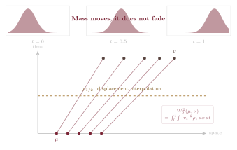

## A Different Kind of Distance

My previous post answered the question "how far apart are two distributions?" using statistical distinguishability: the Fisher tensor measures how rapidly distributions diverge as the parameter moves. It is an infinitesimal ruler on a statistical model, and integrating it along curves produces the global Fisher--Rao distance.

This post answers the same question using a different kind of principle: *physical effort*. Instead of asking how well you can tell two distributions apart, ask how much work it takes to transform one into the other.

The two answers are not in competition: they are sensitive to different structures. Fisher geometry measures statistical distinguishability without requiring a distance between observations. The distance introduced here begins with exactly such a distance on the sample space and charges for moving mass across it. Together, they describe complementary aspects of the geometry of distributions.

## The Earth Mover's Distance

The previous post opened with the inability of the $L^2$ norm: a narrow Gaussian shifted one pixel to the right is intuitively close to the original, yet $\|p-q\|_{L^2}$ treats this as far apart because it sees only pointwise differences, not spatial displacement. The Earth Mover's Distance resolves exactly this failure. Moving a narrow Gaussian one pixel to the right requires only a short transport of mass---the Wasserstein cost is small, matching intuition. Moving it across the image requires a long transport---the cost is large. The metric *charges for displacement*, which is precisely what $L^2$ cannot do. 

Imagine two piles of soil. How much work does it take to rearrange one pile into the shape of the other? The answer depends not only on how different the piles are in abstract, but on where the soil is and how far it must travel. Nearby soil is cheap to move; distant soil is expensive. 

This physical intuition was formalized by Kantorovich [@kantorovich1942]. In discrete applications, *Earth Mover's Distance* most often refers specifically to $W_1$, where transport is charged linearly by distance. The same construction with a $p$-th power cost produces the broader family of Wasserstein distances [@villani2003; @peyre2019].

Let $(X,d)$ be a complete separable metric space, where $X$ is the sample space and $d$ measures distance within that space. For $p\geq1$, write $\mathcal P_p(X)$ for the probability measures with finite $p$-th moment. Given $\mu,\nu\in\mathcal P_p(X)$, the idea is to find the most efficient way to transport the mass of $\mu$ into the configuration of $\nu$.

A *transport plan* is a joint distribution $\gamma$ on $X \times X$ whose marginals are $\mu$ and $\nu$:

$$
\gamma (A \times X)
=
\mu(A),
\quad
\gamma (X \times B)
=
\nu(B)
$$ {#eq-transport-plan-marginals}

for all measurable sets $A,B \subseteq X$. The value $\gamma(A \times B)$ is the amount of mass transported from $A$ to $B$. For $p\geq 1$, the cost of a plan $\gamma$ under the $p$-th power cost is $\int_{X \times X}d(x,y)^p\,d\gamma(x,y)$.

The *Wasserstein-$p$ distance* [@villani2003; @villani2009] minimizes this cost over all valid plans:

$$
W_p(\mu,\nu)
=
\left(
\inf_{\gamma\in\Gamma(\mu,\nu)}
\int_{X \times X}
d(x,y)^p\,d\gamma(x,y)
\right)^{1/p}
$$ {#eq-wasserstein-p-distance}

where $\Gamma(\mu,\nu)$ denotes the set of all transport plans with marginals $\mu$ and $\nu$.

## What Wasserstein Distance Measures

The Wasserstein distance measures the minimum cost of transforming one distribution into another by moving probability mass through the underlying space.

This is the crucial difference from pointwise distances and divergences. The $L^2$ norm compares densities at the same location. KL divergence compares relative probability values at the same location. Wasserstein distance allows mass to move. It asks not only *how much* the distributions differ, but also *where* the difference is located.

A simple example makes the idea precise. Let

$$
\mu = \delta_0,
\qquad
\nu = \delta_a,
$$ {#eq-dirac-point-masses}

where $\delta_0$ is a unit point mass at $0$ and $\delta_a$ is a unit point mass at $a$. Since all the mass must move from $0$ to $a$,

$$
W_p(\delta_0,\delta_a)
=
|a|.
$$ {#eq-wasserstein-dirac-distance}

The answer depends exactly on the distance traveled. A small shift gives a small Wasserstein distance; a large shift gives a large Wasserstein distance.

For general distributions, Wasserstein distance solves the same problem at scale. It finds the cheapest way to match mass in $\mu$ to mass in $\nu$. Moving a small amount of mass a long distance may be cheaper than moving a large amount of mass a short distance, depending on the cost. The distance therefore captures both *how much* probability mass changes and *where* that mass has to go.

This is why Wasserstein distance is useful whenever the geometry of the sample space matters: images, shapes, spatial densities, physical particles, point clouds, probability flows, and generative modeling. It gives a meaningful notion of distance even when two distributions have little or no overlap, because it can still measure how far mass must travel.

In short, Wasserstein distance does not merely compare probability values. It measures the effort required to rearrange one distribution into another.

::: {.callout-tip .math-depth title="Mathematical Depth"}

$W_p$ is a *genuine* metric on $\mathcal P_p(X)$. For $p \geq 1$, it satisfies all metric axioms [@villani2003; @villani2009]:

- *Nonnegativity:* $W_p(\mu,\nu) \geq 0$, with equality iff $\mu=\nu$.

- *Symmetry:* $W_p(\mu,\nu)=W_p(\nu,\mu)$ (the cost of the optimal plan is the same in both directions, by symmetry of $d(x,y)^p$).

- *Triangle inequality:* $W_p(\mu,\rho)\leq W_p(\mu,\nu)+W_p(\nu,\rho)$.

The triangle inequality follows by first using the gluing lemma to place couplings of $(\mu,\nu)$ and $(\nu,\rho)$ on a common space. The ordinary triangle inequality for $d$ and Minkowski's inequality then bound the $L^p$ transport cost from $\mu$ to $\rho$ by the sum of the two intermediate costs.

KL divergence, by contrast, fails both symmetry and the triangle inequality. Fisher and Wasserstein each have infinitesimal and global formulations, but they obtain them from different structures: Fisher from statistical distinguishability, and Wasserstein from transport through the ground space.

:::

## Why *$W_2$* is Special: Brenier's Theorem

The Wasserstein family ($W_p : p \geq 1$) contains many distances, but $W_2$---the case $p=2$ with quadratic cost---has exceptional geometric structure that the others lack.

The key result is Brenier's theorem [@brenier1991].

::: {.callout-tip .math-depth title="Mathematical Depth"}

***Brenier's Theorem.*** Let $\mu,\nu\in\mathcal P_2(\mathbb{R}^n)$, and assume that $\mu$ is absolutely continuous with respect to Lebesgue measure. Then the $W_2$-optimal transport from $\mu$ to $\nu$ is induced by a map

$$
T:\mathbb{R}^n\to\mathbb{R}^n
$$ {#eq-brenier-map}

satisfying

$$
T_{\#}\mu=\nu.
$$ {#eq-brenier-pushforward}

Moreover, this map is unique $\mu$-almost everywhere and has the form

$$
T=\nabla\varphi
$$ {#eq-brenier-gradient-potential}

for some convex function $\varphi:\mathbb{R}^n\to\mathbb{R}$.

In other words, under Brenier's assumptions, the optimal way to move mass for the quadratic cost is not an arbitrary transport plan. It is a deterministic map, and that map is the gradient of a convex potential.

:::

{#fig-transport-plan-vs-brenier-map width="100%" fig-alt="Diagram comparing a Kantorovich transport plan with many faint mass-splitting connections to a Brenier deterministic map with one arrow from each source bin to a target bin."}

For $p=2$, the optimal transport map takes the especially clean form $T=\nabla\varphi$: it is the gradient field, derived from a scalar potential. This structure is specific to the quadratic cost. For $p\neq 2$, the optimal maps may still be characterized through potential functions related to the $c$-transform of the cost, but the clean form $T=\nabla\varphi$ with $\varphi$ convex is lost. The Riemannian geometric structure developed below depends essentially on this gradient form; for $p \neq 2$ the geometry becomes closer to Finsler than Riemannian, and the elegant theory described here does not carry over [@villani2009; @santambrogio2015].

The fact that the optimal $W_2$ map is a gradient field---that it has no rotational component---is already hinting at an algebraic preference for a particular kind of flow. In a future post, when we decompose vector fields into gradient, rotational, and topological components via the Hodge decomposition, this preference will become precise. 

::: {.callout-note .remark-box title="Remark"}

***Two kinds of uniqueness.*** Chentsov's and Brenier's theorems make different claims. Chentsov [@chentsov1982] characterizes the Fisher--Rao metric, up to scale, from an invariance or monotonicity principle. Brenier begins after the Euclidean ground metric and quadratic cost have been chosen; under his assumptions, it says that the resulting optimal coupling is uniquely induced by a map $T=\nabla\varphi$ for convex $\varphi$.

The parallel is therefore not that both the underlying geometries are uniquely forced. It is that structural assumptions sharply constrain two different objects: the metric in Chentsov's theorem and the optimal map in Brenier's theorem.

:::

## The Dynamic View: Benamou-Brenier and Otto Calculus

Brenier's theorem identifies the optimal transport map for $W_2$. A deeper question is whether $W_2$ defines a Riemannian geometry on the space of distributions itself---not just a distance, but a full geometric structure with tangent spaces, inner products, and geodesics. 

The first step toward this is the dynamic formulation of Benamou and Brenier [@benamoubrenier2000], which reinterprets the Kantorovich problem as a variational problem over *flows* rather than couplings. From this point onward, take $X=\mathbb R^n$, or a suitable convex Euclidean domain, so that gradients, divergence, and straight-line interpolation are available.

::: {.callout-tip .math-depth title="Mathematical Depth"}

***The Benamou--Brenier Dynamic Formulation.*** The static Kantorovich formulation defines $W_2$ by minimizing over couplings:

$$
W_2^2(\mu,\nu)
=
\inf_{\gamma\in\Gamma(\mu,\nu)}
\int_{X\times X}
\|x-y\|^2\,d\gamma(x,y).
$$ {#eq-kantorovich-w2}

Benamou and Brenier showed that the same quantity can be computed dynamically. For readability, suppose the endpoint measures admit densities and identify them with those densities. Instead of choosing a coupling all at once, choose a time-dependent density $\rho_t$ and velocity field $v_t$ that move mass from $\mu$ to $\nu$. The evolution must satisfy the continuity equation

$$
\partial_t \rho_t
+
\nabla\cdot(\rho_t v_t)
=
0,
$$ {#eq-benamou-brenier-continuity}

with boundary conditions

$$
\rho_0=\mu,
\qquad
\rho_1=\nu.
$$ {#eq-benamou-brenier-boundary}

The theorem states that

$$
W_2^2(\mu,\nu)
=
\inf_{\rho_t,v_t}
\int_0^1
\int_X
\|v_t(x)\|^2\,\rho_t(x)\,dx\,dt,
$$ {#eq-benamou-brenier-formula}

where the infimum is taken over all pairs $(\rho_t,v_t)$ satisfying the continuity equation and endpoint constraints.

The integrand

$$
\int_X
\|v_t(x)\|^2\,\rho_t(x)\,dx
$$ {#eq-flow-kinetic-energy}

is the kinetic energy of the probability flow at time $t$. Thus $W_2^2(\mu,\nu)$ is the least total kinetic energy required to transport $\mu$ into $\nu$.

This is the dynamic meaning of Wasserstein geometry: a distance between distributions becomes an action-minimization problem over paths of distributions. Kantorovich gives the cheapest matching; Benamou--Brenier gives the cheapest movie.

When the optimal transport is induced by a Brenier map $T=\nabla\varphi$, define the interpolation map

$$
S_t(x)
=
(1-t)x+tT(x),
\qquad
t\in[0,1].
$$ {#eq-interpolation-map}

The corresponding displacement interpolation of distributions is

$$
\rho_t
=
(S_t)_{\#}\mu.
$$ {#eq-displacement-interpolation-pushforward}

Equivalently, particles follow straight-line characteristics from their starting position $x$ to their target position $T(x)$.

$$
x_t=(1-t)x+tT(x),
$$ {#eq-straight-line-characteristic}

and the Eulerian velocity field $v_t$ satisfies

$$
v_t(x_t)=T(x)-x.
$$ {#eq-eulerian-velocity-characteristic}

Along this optimal path,

$$
W_2^2(\mu,\nu)
=
\int_0^1
\|\dot\rho_t\|_{\rho_t}^{2}\,dt
=
\int_0^1
\int_X
\|v_t(x)\|^2\rho_t(x)\,dx\,dt.
$$ {#eq-otto-geodesic-energy}

Here $\|\dot\rho_t\|_{\rho_t}$ denotes the minimum-energy tangent norm defined below. This is the starting point of Otto calculus: path energy is weighted kinetic energy, and along the constant-speed minimizing geodesic it equals $W_2^2(\mu,\nu)$.

:::

{#fig-displacement-interpolation width="100%" fig-alt="Diagram showing density snapshots at t equals 0, 0.5, and 1 above a space-time plot of straight-line transport paths from mu to nu, with the midpoint density marked as displacement interpolation."}

The Benamou--Brenier formulation is more than a computational device. It recasts optimal transport as a problem about *dynamics*: find the flow that carries mass from $\mu$ to $\nu$ at minimum kinetic energy cost. This dynamic picture is a direct precursor to the Schrödinger bridge, covered in a future post. Rather than simply adding entropy to the kinetic action, the Schrödinger problem minimizes path-space relative entropy with respect to a stochastic reference process, typically a diffusion [@leonard2014]. The result can still be read as the cheapest *stochastic* movie rather than the cheapest deterministic one.

The formal Riemannian structure on distribution space, due to Otto [@otto2001], emerges naturally from this dynamic picture. 

::: {.callout-tip .math-depth title="Mathematical Depth"}

***The Otto Calculus.*** At a density $\rho$, the tangent vector is a density variation $\dot\rho$ with zero total mass. Many velocity fields may produce the same variation through the continuity equation

$$
\dot\rho
+
\nabla\cdot(\rho v)
=
0.
$$ {#eq-otto-tangent-continuity}

The Otto metric assigns $\dot\rho$ the minimum weighted kinetic energy among all such representatives:

$$
\|\dot\rho\|_{\rho}^{2}
=
\inf_{v:\,\dot\rho+\nabla\cdot(\rho v)=0}
\int_X
\|v(x)\|^2\rho(x)\,dx.
$$ {#eq-otto-metric}

The minimizing representative is a gradient field $v=\nabla\phi$, where $\phi$ is a scalar potential. Thus rotational or $\rho$-divergence-free components do not change $\dot\rho$ but add kinetic energy. As $\rho$ varies, these minimum-energy norms define the formal Riemannian structure of Otto calculus on $\mathcal P_2(X)$. Its geodesics are displacement interpolations: for $\rho_0=\mu$ and $\rho_1=\nu$ with Brenier map $T=\nabla\varphi$,

$$
\rho_t
=
\left(
(1-t)\text{id}+tT
\right)_{\#} \mu, \quad t \in [0,1].
$$ {#eq-displacement-interpolation-density}

Here $\mathrm{id}$ is the identity map on $X$, and the subscript $\#$ denotes pushforward of a measure. Mass particles move along straight-line characteristics between their starting and target locations; in the optimal representation, no unnecessary rotational component is introduced.

:::

The Otto calculus reveals $W_2$ as a Riemannian metric on distribution space in a way that is both geometrically natural and computationally significant. It connects optimal transport to gradient flows, Fokker-Planck equations, and the dynamics of diffusion---topics we return to in future blog posts. 

::: {.callout-note .remark-box title="Remark"}

***Rigorous foundations.*** Displacement interpolations are genuine constant-speed geodesics in $W_2$, and the kinetic-energy formula is exact. In particular, $\mathcal P_2(\mathbb R^n)$ is a complete geodesic metric space: a Wasserstein geodesic exists between any two measures with finite second moments [@ambrosio2008; @villani2009].

The qualification concerns smoothness, not the existence of metric geodesics. The interpolation may pass through singular measures, and the formal tangent bundle, exponential map, and curvature do not behave globally like those of a finite-dimensional smooth manifold. The framework of gradient flows in metric spaces developed by Ambrosio, Gigli and Savaré [@ambrosio2008] provides the rigorous foundation even when classical Riemannian machinery does not directly apply. Otto calculus supplies the geometric language; metric-space theory states precisely which parts survive.

:::

## What the Wasserstein Metric Cannot See

::: {.callout-note .remark-box title="Remark"}

***A shared variational pattern.*** My first post showed that the Fisher metric is a literal pullback. The model map $\theta\mapsto p(\cdot;\theta)$ sends parameter directions to density perturbations, and pulling back the Fisher--Rao inner product on those perturbations produces the FIM. Scores are the logarithmic representations of the density perturbations.

The Otto construction runs in a different direction. The continuity operator sends a velocity field to the density variation it generates,

$$
v
\longmapsto
-\nabla\cdot(\rho v).
$$ {#eq-continuity-operator-map}

Because many velocity fields generate the same variation, the Wasserstein tangent norm is obtained by minimizing the weighted $L^2(\rho)$ norm over all representatives. It is therefore better understood as a quotient or minimum-energy metric than as another pullback [@otto2001; @ambrosio2008].

The shared pattern is variational rather than literally identical: both geometries measure infinitesimal changes through weighted quadratic norms, but Fisher restricts an ambient metric to a model family, whereas Wasserstein removes dynamically irrelevant velocity components by minimization. This distinction will matter when Hodge decomposition separates gradient motion from rotational and topological components.

:::

The Wasserstein metric is defined on probability measures over the sample space $X$. It requires a ground metric $d$ on $X$ and is sensitive to where mass sits and how far it must travel. It does not require a parametric model. Reparameterizing a model family while keeping its distributions fixed leaves $W_2$ unchanged.

The Wasserstein metric can of course be restricted to a parametric family, but its notion of distance still comes from the geometry of the sample space. It does not measure statistical distinguishability in the Fisher sense: how sensitive likelihoods are to parameter perturbations, or how efficiently a parameter can be estimated from data.

::: {.compact-table .wide-table .label-first-column}

| Aspect | Fisher / FIM | Wasserstein $W_2$ |
|---|---|---|
| What it measures | Statistical distinguishability | Cost of mass transport |
| Underlying structure | Statistical variation of probability laws | Ground metric on sample space $X$ |
| Infinitesimal form | Fisher metric tensor | Otto minimum-energy tangent norm |
| Global distance | Fisher--Rao geodesic distance | Wasserstein distance $W_2$ |
| Parametric role | Pulls back to the FIM on a model family | Can be restricted or pulled back to a model family |
| Support mismatch | KL may be $\infty$; Fisher path may be singular or model-dependent | Still finite if second moments exist |
| Riemannian structure | Finite-dimensional when restricted to regular identifiable models | Formal/infinite-dimensional via Otto calculus; rigorous via metric-space gradient flows |
| Structural theorem | Chentsov characterizes the metric [@chentsov1982] | Brenier characterizes the optimal map after quadratic cost is chosen [@brenier1991] |

: Fisher and Wasserstein as complementary rulers. {#tbl-fisher-wasserstein}

:::

The two metrics are not two approximations to the same ideal distance. They are answers to fundamentally different questions, each of which is the right question in different contexts. The Fisher metric is the right tool when the problem concerns statistical inference, estimation efficiency, and the parametric structure of the model. The Wasserstein metric is the right tool when the problem concerns the spatial layout of data, comparison between distributions without a shared model, or transport of mass through a structured space.

::: {.callout-note .remark-box title="Remark"}

***On completeness.*** It would be wrong to say that either metric is *insufficient* in any absolute sense. Each is perfectly adequate for its intended purpose. The limitation here is relative: *as a full geometry of learning*---one that must account for both the statistical structure of a model and the spatial structure of the data---each metric supplies only one kind of information. Fisher geometry alone provides no ground distance between observations. Wasserstein geometry can induce its own curvature on a parametric family, but it does not encode likelihood sensitivity or estimation efficiency in the Fisher sense. Accounting for both requires a richer picture, which the next posts will gradually develop.

:::

## Wasserstein Geometry in Practice

The Wasserstein distance is not only theoretically natural; it has concrete consequences for modern machine learning. Its main contribution is not merely that it gives another scalar discrepancy between distributions, but that it turns distribution comparison into a problem of moving mass along paths.

This path-based view is especially important in modern generative modeling, where models often learn transformations from a simple source distribution, such as Gaussian noise, to the data distribution.

::: {.callout-note .learning-box title="Consequence for Learning"}

***Flow matching and transport paths.*** Modern generative models increasingly learn not only densities, but *paths between distributions*. In flow matching, one trains a neural network to approximate a time-dependent velocity field $v_t(x)$ that transports a simple source distribution, such as Gaussian noise, into the data distribution.

This is the same *kinematic language* used by the Benamou--Brenier formulation: a time-indexed density $\rho_t$ evolves through a continuity equation,

$$
\partial_t \rho_t + \nabla \cdot (\rho_t v_t)=0,
$$ {#eq-flow-matching-continuity-equation}

and the velocity field determines how probability mass moves through space. Benamou--Brenier adds a variational principle by minimizing kinetic action over such paths; flow matching does not automatically perform that minimization.

In the simplest flow-matching constructions, the path between noise and data is chosen by hand, often through linear interpolation. But a central question is geometric: can we choose or learn paths that are straighter, lower-curvature, or closer to optimal transport paths? Straighter, better-conditioned trajectories can often be integrated accurately with fewer numerical steps at sampling time, although straightness alone is not a universal guarantee of solver efficiency.

This is why optimal transport has become important in modern flow-based generative modeling. OT-based couplings, rectified flows, and optimal-flow-matching methods all try, in different ways, to learn velocity fields that move probability mass efficiently rather than arbitrarily [@lipman2022; @liu2023rectified; @tong2024improving; @kornilov2024].

The connection should not be overstated: flow matching is not automatically optimal transport, and recent work shows that additional assumptions are needed before rectified or gradient-constrained flows can be identified with true OT maps [@hertrich2025relation]. But the geometric principle is clear: Wasserstein geometry gives a language for understanding why the *shape of the probability path* matters.

:::

## The Two Rulers Together

We now have two rulers for probability distributions. Fisher geometry measures statistical distinguishability; Wasserstein geometry measures mass displacement through a ground space. Each answers a different natural question about the geometry of distributions.

The two rulers are not two descriptions of the same subject. Fisher begins from variation in probability laws and, on a regular model family, becomes a Riemannian metric on parameters. Wasserstein begins from a metric on the sample space and becomes a distance---with a formal infinitesimal geometry---on probability measures over that space.

But they are not unrelated either. Both measure infinitesimal changes through weighted quadratic norms, though one arises by pullback and the other by a minimum-energy quotient. Chentsov constrains the statistical metric; Brenier constrains the quadratic-cost optimizer. The parallels are not identities, but they are strong enough to guide the rest of the series.

The next connecting object is not a metric at all. It is an asymmetric divergence: the KL divergence. My next post will examine why KL is richer than a metric, how its two directions produce different learning behaviors, how Fisher geometry appears as its local second-order shadow, and how path-space KL points directly toward the Schrödinger bridge.

::: {.post-end}
༺  The End  ༻
:::
